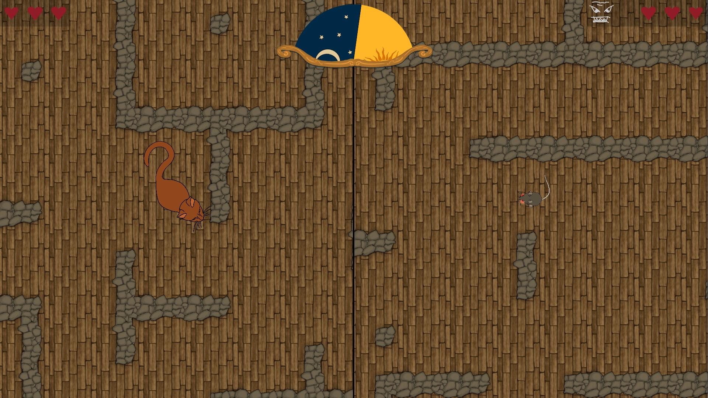
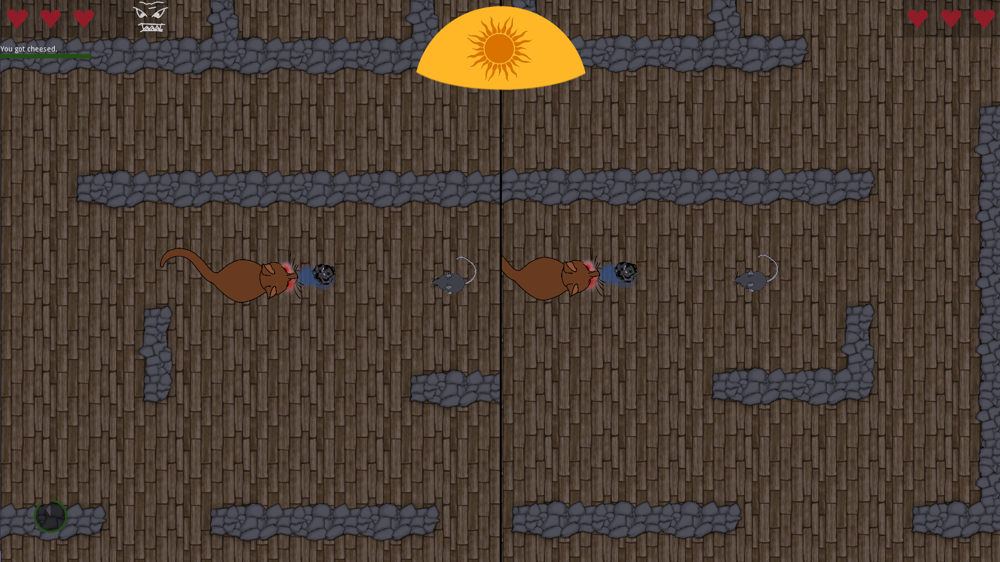

# Basement Battles

A 2 player catch game with shifting roles based on the day/night cycle.

Built in Godot and C#. All Assets created by us.

Created as part of the [team neusta Game Jam 2021](https://team-neusta-gamejam.de).

## Controls

### Player 1 (Cat)

| Action | Keyboard | Gamepad          |
| ------ | -------- | ---------------- |
| Left   | A        | Left Stick Left  |
| Right  | D        | Left Stick Right |
| Up     | W        | Left Stick Up    |
| Down   | S        | Left Stick Down  |
| Attack | Q        | Left Trigger     |
| Jump   | E        | Right Trigger    |

### Player 2 (Mouse)

| Action | Keyboard | Gamepad          |
| ------ | -------- | ---------------- |
| Left   | NumPad 4 | Left Stick Left  |
| Right  | NumPad 6 | Left Stick Right |
| Up     | NumPad 8 | Left Stick Up    |
| Down   | NumPad 5 | Left Stick Down  |
| Attack | NumPad 7 | Left Trigger     |
| Jump   | E        | Right Trigger    |

## Screenshots

## Credits

* Alena
* Jonathan Kortjohann
* Max Jöhnk
* Philip Reichenberg